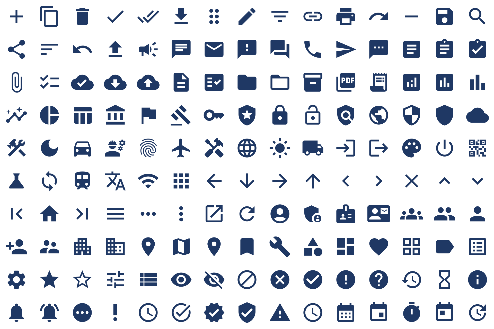

# Slate

**Material Design icons in Power Apps, as inline SVG. No CDN, no media files, no connector.**

Power Apps ships a fixed set of icons and no supported way to add your own without
uploading media assets to every app. Slate closes that gap: it renders any Material
Design icon from path data held in the app itself, at any size, in any colour, from
a formula.

Paste one YAML file into Power Apps Studio and you have a searchable browser for
150 icons that hands you the exact Power Fx for each one.



---

## Why this exists

The usual answers to "custom icons in Power Apps" all have a cost:

| Approach | Problem |
| --- | --- |
| Upload SVG/PNG as media | Per-app assets, re-uploaded on every fork, bloats the `.msapp`, one colour per file |
| Icon font | Not supported in canvas apps |
| Reference a CDN (`fonts.googleapis.com`, jsDelivr) | Blocked by DLP or unreachable on GCC / GCC High / DoD; also a runtime dependency on the public internet |
| Base64 PNG in a variable | Fixed size, fixed colour, blurry when scaled, huge strings |
| Third-party icon component | Procurement, ALM, and tenant-approval overhead |

Slate takes a different route: **the icon is a formula, not a file.** Path data is
plain text held in the app document, and the `Image` property builds a
`data:image/svg+xml` URI at render time. That means:

- **Zero network calls.** Nothing to allowlist. Works in a fully air-gapped GCC High tenant.
- **Any colour, from an expression.** Bind the fill to your theme, to a status field, to `Self.Pressed`.
- **Vector at any size.** One definition covers 16px and 64px.
- **Travels with the app.** Solution export/import carries it; no media re-upload, no broken references after a fork.

---

## Quick start

### 1. Prove it works on your tenant (30 seconds)

Copy the contents of [`src/slate-minimal.pa.yaml`](src/slate-minimal.pa.yaml),
open Power Apps Studio, select the canvas and press <kbd>Ctrl</kbd>+<kbd>V</kbd>.

Eight icons should render. If they do, the technique is good on your tenant.

### 2. Paste the full browser

Copy [`src/slate-icon-browser.pa.yaml`](src/slate-icon-browser.pa.yaml) and paste it
the same way. You get a searchable, filterable grid of all 150 icons with a live
colour and size preview, and a read-only box containing the exact one-line Power Fx
for whichever icon is selected — select all, copy, paste into your own `Image`
property.

> **If Studio rejects the paste**, use
> [`src/slate-icon-browser.clipboard.yaml`](src/slate-icon-browser.clipboard.yaml)
> instead. Studio accepts two YAML shapes depending on your release wave, and this
> repo generates both from one source. See [Two YAML dialects](#two-yaml-dialects).

### 3. Wire it into a real app

For production, don't leave the icon table in `OnVisible`. Paste
[`src/slate-app-formulas.fx`](src/slate-app-formulas.fx) into **App → Formulas**,
then anywhere in the app:

```powerapps
// Image property
Slate_Icon("shield", RGBA(16, 124, 16, 1))

// ImagePosition property
ImagePosition.Fit
```

Named formulas are lazily evaluated and cached, so this costs nothing at app launch
— unlike a 150-row `ClearCollect` in `App.OnStart`.

---

## How it works

The whole mechanism is one expression:

```powerapps
"data:image/svg+xml;utf8," & EncodeUrl(
    "<svg xmlns=""http://www.w3.org/2000/svg"" viewBox=""0 0 24 24"" fill=""#1F3864""><path d=""M10 20v-6h4v6h5v-8h3L12 3 2 12h3v8z""/></svg>"
)
```

Four details that are each the difference between an icon and a blank box:

1. **`;utf8,`** — not `;charset=utf-8,` and not a bare `,`. Power Apps only accepts this form.
2. **`xmlns="http://www.w3.org/2000/svg"`** is mandatory. Browsers infer it; the Power Apps image host does not.
3. **`EncodeUrl`** around the markup. Without it the `#` of a hex colour terminates the URI and everything after it is dropped.
4. **6-digit hex fill.** `RGBAToHex()` returns `#RRGGBBAA`; the eight-digit form renders as black. Use `Left(RGBAToHex(c), 7)`.

Set the host `Image` control's `ImagePosition` to `Fit`. The SVG carries a `viewBox`
but no width or height, so it scales to whatever the control is.

Full detail, including the state-driven and theme-bound patterns, is in
[`docs/HOW-IT-WORKS.md`](docs/HOW-IT-WORKS.md).

---

## Two YAML dialects

Power Apps Studio accepts two clipboard shapes, and which one your tenant takes
depends on its release wave. Rather than make you guess, every screen is generated
in both:

| File | Shape | Use when |
| --- | --- | --- |
| `*.pa.yaml` | Top-level `Screens:` map, unversioned control names | Current Studio; also what `pac canvas` and Dataverse Git integration read |
| `*.clipboard.yaml` | Flat list of controls pinned to `Control: Label@2.5.1` style versions | Older builds, or when the `Screens:` form is rejected |
| `*-onvisible.fx` | The screen's `OnVisible` formula on its own | Pair with `*.clipboard.yaml`, which carries controls only |

If a clipboard paste fails on an unrecognised control, it is almost always the
`@version`. Copy any control of that type out of your own app, look at the version
it emits, and match it. The map lives in `CONTROL_VERSIONS` in
[`tools/build_slate.py`](tools/build_slate.py).

---

## Regenerating

The icon set is generated, not hand-maintained. Edit
[`tools/icons.txt`](tools/icons.txt) — one icon per line, `name|category|search keywords` —
then:

```bash
python3 tools/build_slate.py                 # filled style (default)
python3 tools/build_slate.py --style outlined
python3 tools/build_slate.py --offline       # rebuild YAML from cached JSON, no network
python3 tools/verify_slate.py                # validate before you ship
```

`build_slate.py` pulls the official Material SVGs, reduces each to a single `d`
string, and writes the JSON, both YAML dialects, and the `App.Formulas` file.
Only Python 3 and the standard library are needed to build; verification also wants
`pyyaml`, `cairosvg`, and `pillow`.

### Verification

`tools/verify_slate.py` is the reason you can paste this without reading it first:

1. Both YAML dialects parse as YAML.
2. Every Power Fx string literal is quote-balanced.
3. The SVG each formula builds is well-formed XML.
4. Each data URI round-trips through `EncodeUrl` back to that exact SVG.
5. Every icon rasterises to non-empty artwork.
6. **Every icon is compared pixel-for-pixel against the upstream Google SVG.**

Check 6 exists because it caught a real bug. Material's optimised paths open with a
*relative* `m` moveto. Merging a multi-path glyph by concatenating `d` strings
therefore measures the second path from the end of the first and silently shifts it.
The fix is to prefix `M0 0` before each appended subpath; the check is what proved
the fix worked.

---

## What's in the box

```
src/
  slate-minimal.pa.yaml            8 icons — paste this first
  slate-icon-browser.pa.yaml       150-icon searchable browser
  slate-app-formulas.fx            App.Formulas: named formula + UDFs
  *.clipboard.yaml                 alternate dialect of each screen
  *-onvisible.fx                   OnVisible formulas for the clipboard dialect
data/
  icons.filled.json                generated icon table with upstream provenance
tools/
  icons.txt                        the curated set — edit this
  build_slate.py                   generator
  verify_slate.py                  validator
docs/
  HOW-IT-WORKS.md                  the technique in detail, plus patterns
  GCC-NOTES.md                     GCC / GCC High / DoD specifics
  preview.png                      contact sheet of the whole set
```

150 icons across Action, Communication, Content, Data, Government, Misc,
Navigation, People, Places, Settings, Status, and Time.

---

## Limitations

- **Two-tone and other opacity-based styles are not supported.** The generator
  rejects them rather than emitting something that renders wrong; `filled`,
  `outlined`, `round`, and `sharp` all work.
- **Icons using `transform` are rejected** for the same reason. None in the
  curated set do.
- **`Slate_Icon()` needs the User-defined functions toggle** (Settings → Updates →
  New). If your tenant doesn't have it yet, the `SlateIcons` named formula and the
  inline pattern both work without it — see `docs/HOW-IT-WORKS.md`.
- **Very large icon tables are still app-document weight.** 150 icons is roughly
  45 KB of formula text. That is fine; ten thousand would not be. Curate.

---

## Licence

Slate's tooling, YAML, and documentation: **MIT** — see [LICENSE](LICENSE).

Material Design Icons artwork (the path data in `data/` and every generated file):
**Apache License 2.0**, © Google. See [NOTICE.md](NOTICE.md). Slate is not
affiliated with or endorsed by Google or Microsoft.
